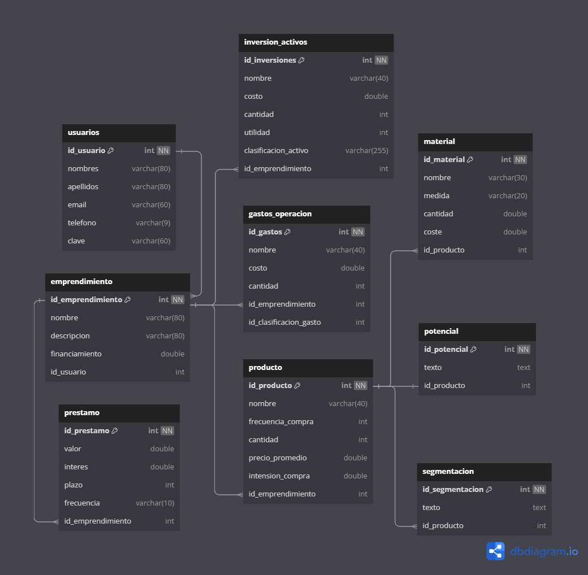

# Wedo-app
## Instalación
Para instalar las dependencias necesarias, ejecute el siguiente comando:

``` bash
pnpm install
```

## Uso

- Para iniciar el servidor, ejecute el siguiente comando:
``` bash
pnpm start
```

- Para iniciar en modo desarrollo, ejecute el siguiente comando:

``` bash
pnpm run dev
```
## Tecnologías

- Node js
- TypeScript
- Express
- Auth Basic
- MySQL (base de datos)

## Documentación

### Configuración del proyecto

Usamos ESLint, es una herramienta de análisis de código estático que se utiliza para identificar y reportar patrones encontrados en el código ECMAScript/JavaScript. En este proyecto, ESLint se configura para trabajar con TypeScript y asegurar que el código siga las mejores prácticas y convenciones de estilo.

El archivo de configuración de ESLint `eslint.config.js` incluye reglas específicas para TypeScript.

TypeScript y el archivo `tsconfig.json` nos permite la creación de aleas para los imports dentro de los archivos, el cual nos ayuda para url grande por ejemplo `./routes/empresas.ts` usando aleas sería `@routes/empresas`

El proyecto cuenta con un archivo **.env**, este guarda las variables de entorno que usamos en el código, se hace para no revelar información privada sobre la conexión a la base de datos, credenciales para verificar la IP, credenciales de autentificación y el patrón para la incriptación de contraseñas.

Estructura del archivo **.env**:
```
```
La entrada del servidor `(app.ts)`, crea el app que viene de express, luego crea el puerto que se usará, si no viene el puerto en las variables de entorno lo iniciará en el puerto 3000 por defecto.

- Usa el middleware de `express` para indicarle que se usará formato `json`:
- Utiliza `morgan` para que en modo desarrollo podamos ver en consola las peticiones que se le hacen a nuestro servidor.
- Cuando se hace una petición, esta pasa por dos middleware, uno de ellos busca la ruta a la que se le hizo la petición, si no está en el router muestra un error `404` que indica que la url no existe, de lo contrario se activa el segundo middleware que verifica que dentro de los headers de la petición venga las claves de autentificación, si no vienen o son incorrectas, muestra un error `401` que indica que no está autorizado.

### Organización de carpetas

- **node_modules/**: Contiene las dependencias del proyecto instaladas a través de pnpm.
- **src/**:
  - **controllers/**: Contiene los controladores que manejan la lógica de negocio y las interacciones con la base de datos.
  - **database/**: Contiene la conexión a la base de datos en Mongo Atlas, verifica la IP para agregarla a las IP permitidas de Mongo.
  - **lib/**: Contiene scripts del proyecto que automatizan los procesos que realiza el servidor cuando hace la autentificación, peticiones, errores, entre otras.
  - **models/**: Contiene todos los modelos de la arquitectura de la base de datos
  - **router/**: Contiene las definiciones de las rutas de la API.
  - **types/**: Contiene los types, interfaces, enums que usamos para definir los tipos de TypeScript.

## Endpoints

Cada uno de estos endpoind corresponde a una `url` específica y un método http `(GET, POST, PUT, DELETE, entre otros)`, que define la acción que se realizará.

Las respuesta que de el servidor luego de la petición será en archivos `json`.

## Modelo relacional


## Diccionario de datos
[Diccionario de datos](https://inatecni-my.sharepoint.com/:x:/g/personal/maykeling_gonzalez3_tecnacional_edu_ni/ESWPc8hQdEFKjxuS8i9Kyb8B0BpvRAjVFz7RxRttAFCiaw?e=OeflqZ)

## Normalización
[Normalizacón](https://inatecni-my.sharepoint.com/:x:/g/personal/maykeling_gonzalez3_tecnacional_edu_ni/EXgeS8vs6QtLpwwfxupUgw0BjoWEYoXOiCzfuLqsn9UsAQ?e=7gSLbR)


Proyecto Hackathon 2024 - Web app bussines
